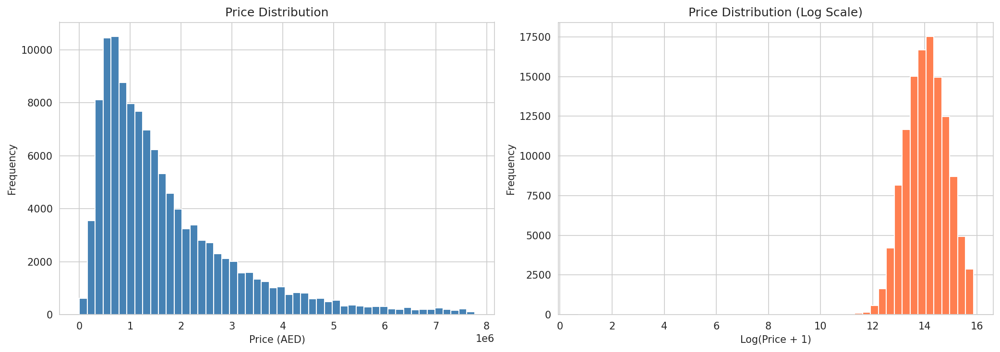
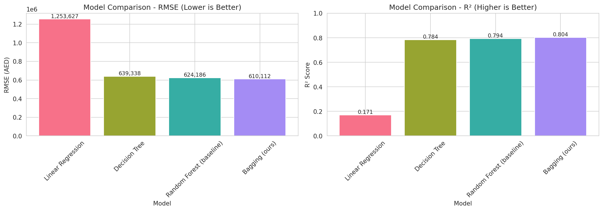
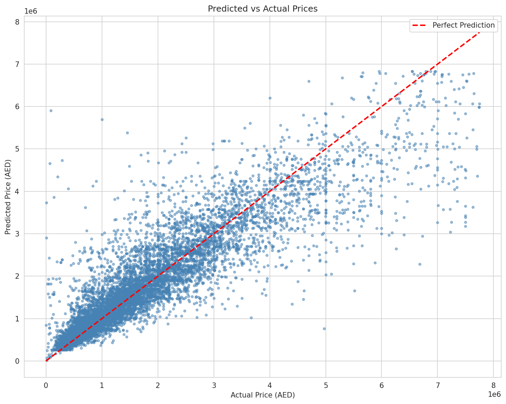
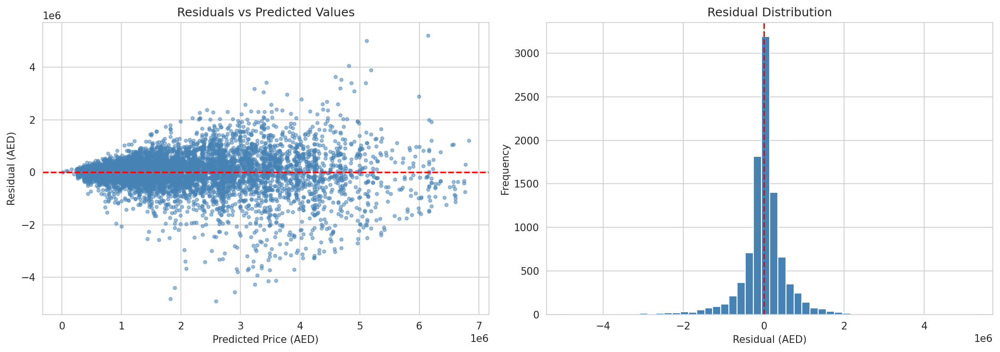
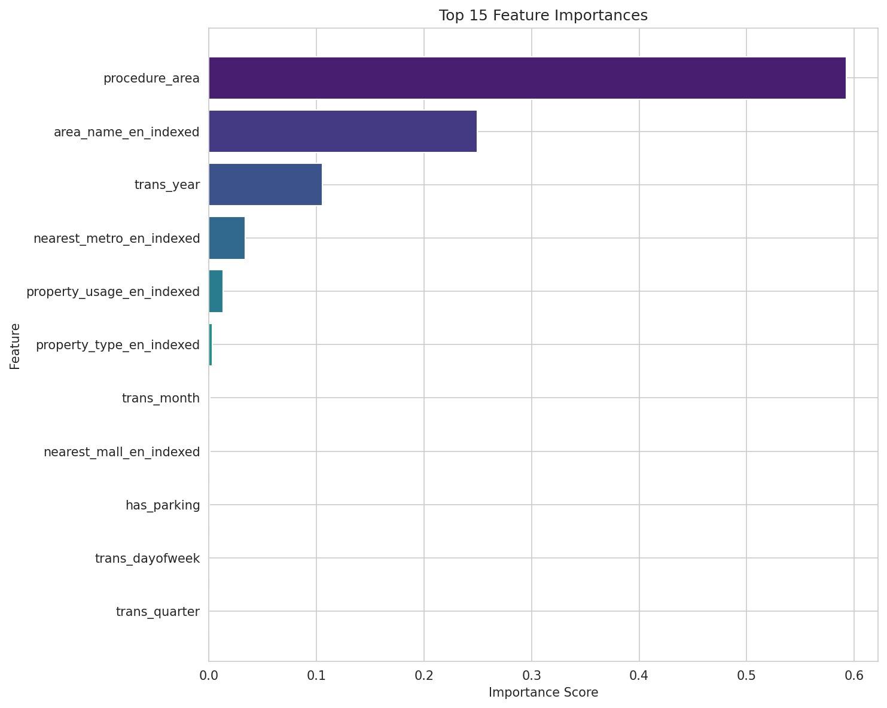

# bigboyz - Dubai Real Estate Price Prediction

**CSCI316: Big Data Mining Techniques and Implementation**
University of Wollongong in Dubai

---

## Project Overview

A large-scale machine learning pipeline to predict real estate transaction prices in Dubai using the Dubai Land Department's transactions dataset (~1.5 million records).

**Business Question:** *Can we accurately predict real estate transaction prices in Dubai based on property characteristics, location, and temporal factors?*

---

## Key Features

- **Manual 10-Fold Cross-Validation**: Implemented from scratch without using `CrossValidator` or `TrainValidationSplit`
- **Custom Bagging Ensemble**: Implemented from scratch without using `RandomForestRegressor`
- **Apache Spark (PySpark)**: All data processing at scale
- **Docker**: Containerized environment for reproducibility

---

## Project Structure

```
316-assignment1/
├── docker/
│   ├── Dockerfile              # Container definition
│   └── docker-compose.yml      # Multi-container orchestration
├── data/
│   └── Transactions.csv        # Raw data (download separately)
├── notebooks/
│   └── bigboyz.ipynb           # Main deliverable notebook
├── src/
│   ├── __init__.py
│   ├── data_ingestion.py       # Spark data loading utilities
│   ├── data_cleaning.py        # Preprocessing & cleaning
│   ├── feature_engineering.py  # Feature transformation pipeline
│   ├── cross_validation.py     # Manual 10-fold CV (FROM SCRATCH)
│   ├── bagging_ensemble.py     # Bagging implementation (FROM SCRATCH)
│   └── evaluation.py           # Metrics & visualization
├── web/
│   ├── app.py                  # Streamlit web interface
│   ├── train_model.py          # Model training for web app
│   └── requirements.txt        # Web app dependencies
├── outputs/
│   └── figures/                # Generated charts/plots
├── report/                     # Final report PDF
├── presentation/               # Slides and video link
├── CLAUDE.md                   # AI assistant context
├── PROJECT_PLAN.md             # Detailed implementation guide
├── README.md                   # This file
└── requirements.txt            # Python dependencies
```

---

## Prerequisites

- Docker & Docker Compose
- ~8GB RAM available for Spark
- ~2GB disk space for data

---

## Quick Start

### 1. Clone the Repository

```bash
git clone <repo-url>
cd 316-assignment1
```

### 2. Download the Dataset

The dataset is too large for GitHub. Download it manually:

1. Visit [Dubai Pulse - DLD Transactions](https://www.dubaipulse.gov.ae/data/dld-transactions/dld_transactions-open)
2. Download the transactions CSV file
3. Place it in the `data/` folder as `Transactions.csv`

### 3. Start the Docker Environment

```bash
cd docker
docker-compose up --build
```

### 4. Access Jupyter Notebook

Open your browser and navigate to:
```
http://localhost:8888
```

### 5. Run the Notebook

Open `notebooks/bigboyz.ipynb` and run all cells.

---

## Running Without Docker

If you prefer to run locally:

```bash
# Create virtual environment
python -m venv venv
source venv/bin/activate  # On Windows: venv\Scripts\activate

# Install dependencies
pip install -r requirements.txt
pip install pyspark jupyter

# Start Jupyter
jupyter notebook notebooks/bigboyz.ipynb
```

---

## Web Interface (Streamlit)

The project includes a web interface that allows users to interactively predict real estate prices using the custom BaggingRegressor model.

### Features
- Input property details through an intuitive UI
- Uses the **actual custom BaggingRegressor** (from scratch) with PySpark
- Real-time price predictions
- Model performance metrics display

### Running the Web Interface (Docker - Recommended)

The web app runs inside Docker, so you don't need to install Java or PySpark locally. **The model is pre-trained and ready to use** - no additional setup required.

#### Step 1: Start Docker Services

```bash
cd docker
docker-compose up --build
```

This starts two services:
- **Jupyter Notebook** at `http://localhost:8888`
- **Web Interface** at `http://localhost:8501`

#### Step 2: Access the Web Interface

Open your browser and navigate to:
```
http://localhost:8501
```

The model is pre-trained and included in the repository, so you can start making predictions immediately.

#### (Optional) Re-train the Model

If you want to re-train the model with new data or different parameters:

```bash
docker exec -it bigboyz-spark bash -c "export PYTHONPATH=/usr/local/spark/python:/usr/local/spark/python/lib/py4j-0.10.9.7-src.zip && cd /home/jovyan/work/web && python train_model.py"
```

### Running Without Docker (Requires Java 8+ and PySpark)

If you prefer to run locally, you need Java and PySpark installed:

```bash
# Install Java (if not installed)
# Windows: Download from https://adoptium.net/
# macOS: brew install openjdk@11
# Linux: sudo apt install openjdk-11-jdk

# Install PySpark
pip install pyspark

# Start the web app (model is pre-trained)
cd web
streamlit run app.py
```

### Web Interface Files

```
web/
├── app.py              # Streamlit application
├── train_model.py      # PySpark model training script
├── requirements.txt    # Web app dependencies
├── spark_model/        # Pre-trained model (included in repo)
│   ├── bagging_model/  # Custom BaggingRegressor trees (10 trees)
│   └── feature_pipeline/ # StringIndexers and VectorAssembler
├── feature_options.json # Dropdown values for UI
└── model_config.json    # Model configuration and metrics
```

### Input Fields

The web interface allows you to:
1. Enter property size in sqm
2. Select property type (Villa, Land, Building, Unit)
3. Select property usage (Residential, Commercial, etc.)
4. Select Dubai area from 231 neighborhoods
5. Select nearest metro station and mall
6. Pick a transaction date
7. Get instant price predictions

---

## Source Code Modules

| Module | Description |
|--------|-------------|
| `data_ingestion.py` | Spark session creation, CSV loading with schema |
| `data_cleaning.py` | Missing value handling, outlier removal, filtering |
| `feature_engineering.py` | Categorical encoding, temporal features, vector assembly |
| `cross_validation.py` | **Manual 10-fold CV implementation (FROM SCRATCH)** |
| `bagging_ensemble.py` | **Custom Bagging Regressor (FROM SCRATCH)** |
| `evaluation.py` | Metrics calculation, comparison tables, visualizations |

---

## Models Implemented

### Baselines (using Spark MLlib)
- Linear Regression
- Decision Tree Regressor
- Random Forest Regressor

### Custom Implementation (FROM SCRATCH)
- **Bagging Ensemble Regressor**
  - Base learner: `DecisionTreeRegressor` from MLlib
  - Bootstrap sampling: implemented manually
  - Prediction aggregation: averaging implemented manually

---

## Evaluation Metrics

| Metric | Description |
|--------|-------------|
| RMSE | Root Mean Square Error |
| MAE | Mean Absolute Error |
| R² | Coefficient of Determination |

---

## Results

### Dataset Statistics

| Metric | Value |
|--------|-------|
| Raw records | 1,644,778 |
| After cleaning | 1,201,489 (73% retained) |
| Training set | 961,535 (80%) |
| Holdout test set | 239,954 (20%) |
| Features | 11 |

### Model Performance (Holdout Test Set)

| Model | RMSE (AED) | MAE (AED) | R² |
|-------|------------|-----------|-----|
| Linear Regression | 1,252,303 | 912,253 | 0.1750 |
| Decision Tree | 641,924 | 376,635 | 0.7832 |
| Random Forest (baseline) | 626,285 | 377,767 | 0.7937 |
| **Bagging (ours)** | **615,495** | **362,048** | **0.8007** |

### Key Findings

1. **Custom Bagging achieves best performance** - Our from-scratch implementation outperforms the Random Forest baseline with R² = 0.8007 vs 0.7937

2. **Tree-based models excel** - Linear Regression fails to capture the non-linear relationship between features and price (R² = 0.17)

3. **Property area is the dominant predictor** - Feature importance analysis shows `procedure_area` (sqm) is the most important feature, followed by location (`area_name_en`)

4. **No overfitting** - Cross-validation and test results are consistent (within 1% difference)

### Visualizations

#### Price Distribution


#### Model Comparison


#### Cross-Validation Results


#### Predictions vs Actual (Bagging)


#### Residual Analysis


#### Feature Importance


### Conclusion

**Can we accurately predict real estate transaction prices in Dubai? Yes, with ~80% accuracy using tree-based ensemble methods.**

| Aspect | Finding |
|--------|---------|
| **Best Model** | Custom Bagging (R² = 0.80) - explains 80% of price variance |
| **Prediction Error** | ~615,000 AED RMSE / ~362,000 AED MAE |
| **Most Important Feature** | Property size (`procedure_area`) dominates predictions |
| **Worst Model** | Linear Regression (R² = 0.17) - relationship is non-linear |

**What the results mean:**

- **80% of price variation is explainable** from just 11 features (size, location, property type, temporal factors)
- **20% remains unexplained** - likely due to factors not in the dataset (floor/view, interior condition, negotiation dynamics, market sentiment)
- **Custom implementation works** - Our from-scratch Bagging outperformed MLlib's Random Forest
- **Location matters** - After property size, `area_name_en` is the second most important feature

**Business implications:**
- **Sellers** can estimate fair market value within ~360K AED
- **Buyers** can identify overpriced/underpriced properties
- **Investors** can model expected returns based on property characteristics

---

## Important Notes

### From-Scratch Requirements

This project implements the following **from scratch** as per assignment requirements:

1. **10-Fold Cross-Validation** (`src/cross_validation.py`)
   - Manual fold assignment
   - Manual train/validation splitting
   - Manual metric aggregation

2. **Bagging Ensemble** (`src/bagging_ensemble.py`)
   - Manual bootstrap sampling
   - Manual training of multiple trees
   - Manual prediction averaging

### What We CAN Use from MLlib

- `DecisionTreeRegressor` as base learners
- `RegressionEvaluator` for metrics
- `StringIndexer`, `VectorAssembler`, `StandardScaler` for feature engineering

### What We CANNOT Use

- `CrossValidator`
- `TrainValidationSplit`
- `ParamGridBuilder`
- `RandomForestRegressor` as the main ensemble model

---

## Troubleshooting

### Memory Issues
If you encounter memory errors, adjust Spark configuration in `src/data_ingestion.py`:
```python
.config("spark.driver.memory", "8g")
.config("spark.executor.memory", "8g")
```

### Data Loading Issues
Ensure your CSV file matches the expected schema. You may need to update column names in:
- `src/data_ingestion.py` - schema definition
- `notebooks/bigboyz.ipynb` - column name variables

---

## Authors

**Team bigboyz**
CSCI316 - Big Data Mining
University of Wollongong in Dubai

---

## License

This project is for educational purposes as part of CSCI316 coursework.
